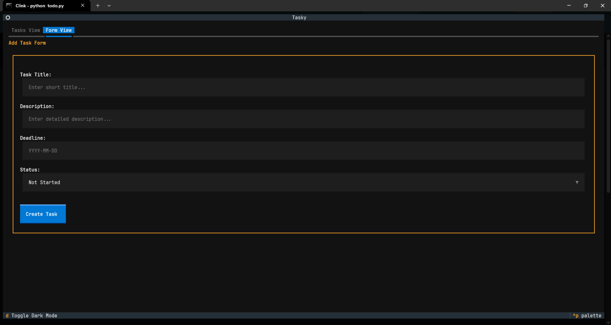
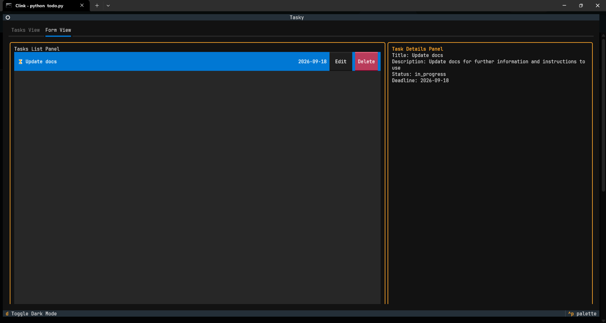

A simple todo manager
for more try running 
```python
python -m venv
Goto Scripts and activate the venv
pip install textual textual-dev
python todo.py
```
CTRL+p for more
see this image for inter faces



